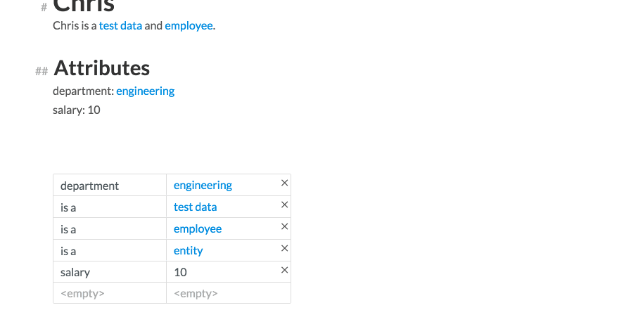
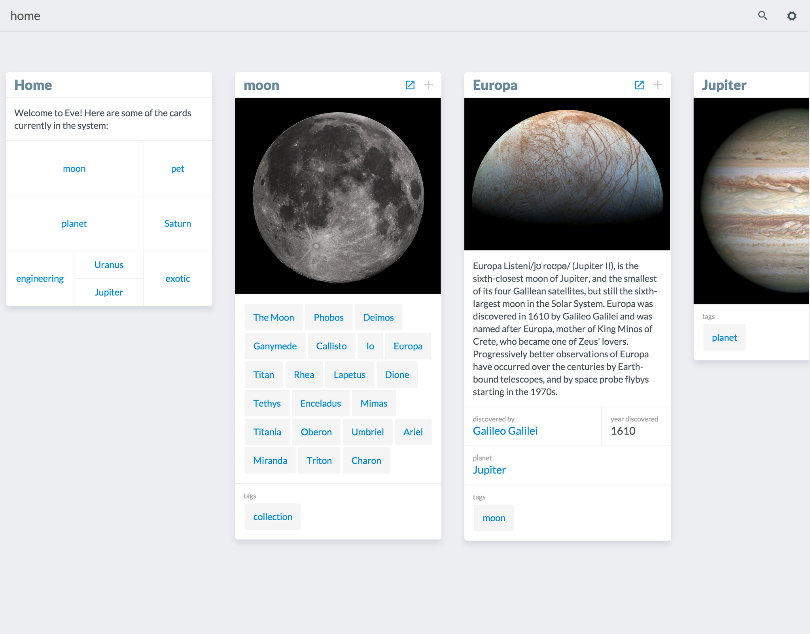
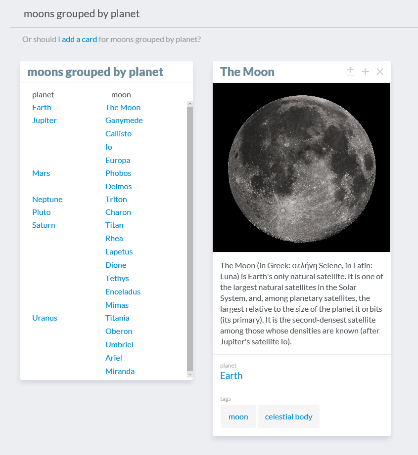
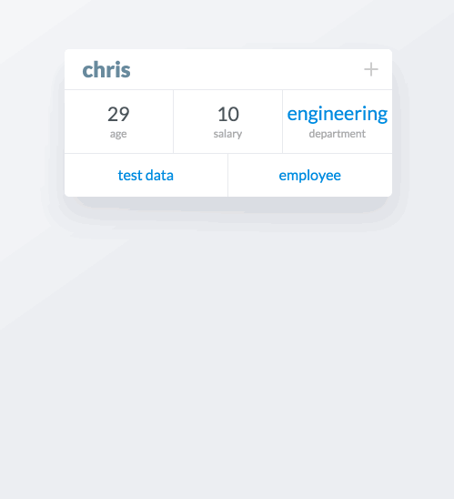
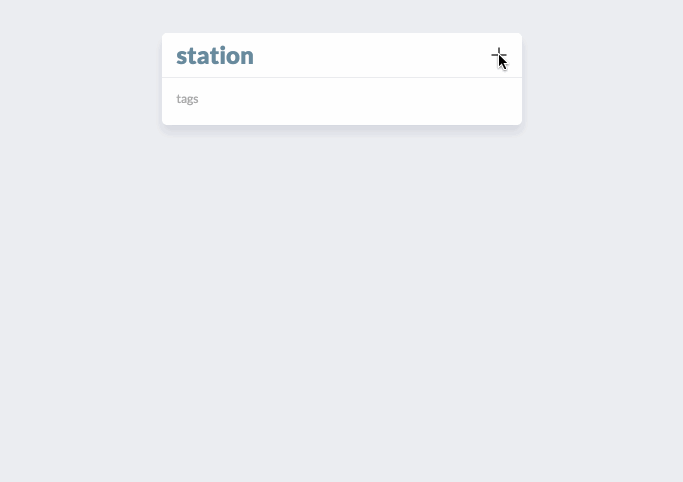

At the start of 2016 we decided it was about time for another "release". I say "release" since we are developing in the open (for now, that's happening on our [Github](http://www.github.com/witheve). In January, our cadence was still very research-focused, but it had been almost 6 months since we [released V0](http://www.chris-granger.com/2015/08/17/version-0/). So we targeted February to showcase our next direction to the public.

### Platform Work

In October, Chris wrote a new runtime in TypeScript for his CardWiki experiment. Our V0 runtime was written in Rust, which was fine except for the distribution part of the story; with TypeScript, we can ship the runtime to the client's browser and have it do all the work. This was a lot easier compared to having the user download and install Rust, compile the runtime, and then compile and connect to a server. All of the proceeding work refers to the TypeScript

### Syntax

Eve has been missing a syntax for a while, but we abandoned it in 2015. You can check out the last syntax on [Github](https://github.com/witheve/Eve/tree/syntax/), or see it in action in a [previous post](http://incidentalcomplexity.com/2014/12/01/nov/). Our theory at the time was that Eve is a language for non-programmers, therefore we should use it as our users would i.e. without a syntax.

Thus, as we developed the [Foursquare clone](http://incidentalcomplexity.com/2015/07/02/mar-jun/), V0, and the [madlibs editor](http://incidentalcomplexity.com/2015/10/15/jul-sept/), we had no formal syntax for Eve. As we've learned, this was probably not a good idea for several reasons.

1. Testing - Writing tests for a GUI is hard, especially when both the user interface and the runtime are constantly changing. Thus, we had no way to verify that a change in the runtime wouldn't break the client, or vice versa.

2. Sharing - Sharing graphical code is not impossible, but you first have to figure out what it is you're sharing. For us, this was very much a problem, because our ideas behind the meaning of code in a GUI was constantly in flux. With a syntax, you share text code and you're done.

3. Bug reporting/reproducing - This is a combination of (1) and (2), but is sinister in its own right. If you find a bug in the client, you first have to reproduce it. For a GUI client, this is problematic due to issues as mundane as screen resolution and DPI, browser version, or the size of a window. Once you've reproduced the bug, now you have to share the steps with a team member. How? Do you make a video? Do you write a detailed list of instructions? With a syntax, you just copy and paste the code and you're done.

So by January 2016, we decided to invest in a syntax, as it would pay dividends by ameliorating the above. Let's take a look at how it works:

```
(query
 (select "eavs" :entity "corey" :attribute "age" :value corey|age)
 (project! "corey's age" :age corey|age))
```

Here is an Eve program that returns an attribute `age` for an entity `corey`. Each statement in an Eve program is a symbolic expression (s-exp) that starts with the keyword `query`. A `query` can contain any number of s-exps, which can be a `select`, a `project!`, or another `query`.

Select statements ask Eve to find all data in a table with the specified fields. Here, the table is `"eavs"` and the fields are `entity`, `attribute`, and `value`. Fields may be bound or unbound. In this case `entity` is bound to `"corey"` and `attribute` is bound to `"age"`. However, `value` is left unbound, and is actually aliased as `corey|age`.

Project (the verb, not the noun) statements insert data into a new table, in this case `"corey's age"`. A new field is created called `age`, which is bound to `corey|age`.

Okay, that's fine. Let's look at something a little more complicated: 

```
(query
 (select "eavs" :entity :attribute "salary" :value salary)
 (select "sum" :sum output0 :input salary)
 (project! :sum-of-salaries output0))
```

This program selects every salary in Eve, sums them together, and projects that value into a new table. The first thing to note is on line 2, where `entity` is unbound. This select says "get all entities in the system that have an attribute salary". Thus, we would expect the variable `salary` to be a set of salaries in the system e.g. `{$10, $11, $15}`.

The only material difference between this program and the last is the third line. Here, "sum" is a special primitive table that's really an aggregate (known as a fold or reduce in other contexts). Sum takes whatever is bound to `input` and aggregates that to a single value e.g. `{$36}`.

This is notable because it is the first time we've been able to fit aggregates cleanly into the system. Aggregates are hard in our system because of how they operate; everything else transforms sets into sets. Aggregates collapse sets into a single value. So they've always existed as a sort of second class citizen that you have to call out specifically. But in this case, aggregates are just another relational table, like anything else.

### WikiEve

WikiEve started from Chris' [CardWiki experiment](), which used a natural language query parser as an interface for Eve. WikiEve extended this concept to a full frontend UI. Really, WikiEve started out as something very different I will call MarkdownEve.

#### MarkdownEve 

In CardWiki, a card was just a piece of UI that represented an entity, collection, or query result. The cards themselves can be thought of as living wiki articles, that update as changes occur. Like wikis, these cards could contain plain text and formatting (Markdown in this case, hence the moniker) that had no specific semantic meaning as far as Eve is concerned. Unlike a wiki, semantic meaning could be added in the form of inline queries. The existence of inline queries in a card provided the basis for computation in the system, much like a contemporary [demo by Bret Victor](https://s3.amazonaws.com/worrydream.com/ClimateChange/Video/06-autocomplete.mov) demonstrated.


Here we are editing a card relating to the entity `Josh`. The beginning of an inline query is indicated by typing `=`. As in CardWiki, queries are stated in natural language and are parsed by a special [natural language query parser](). This sentence adds two tags (`test data` and `employee`) to Josh and then queries for his `salary`.

We can create whole documents this way. 



There's a lot going on here, so I'll break it down. Here is a card for the entity `Chris`. We see that he belongs to two collections, `test data` and `employee`. His `department` attribute is `engineering` and his `salary` attribute is `10`. At the bottom is a summary table of all his properties. We then add a `related to` attribute, whose value is another entity `ryan`. We can actually edit Ryan's card from Chris' card by clicking on his name. A modal pops up, which we can edit in place, or maximize to fill the window, replacing Chris' card. Finally, we embed a list of all Chris' employees in the page.

What we had at this point was basically a live document editor, where each "card" was more like a whole document than a card. This UI which might work as a competitor to Medium or Dropbox's paper, but can you write programs this way? We tried ourselves first, but the result was a resounding "No". Some of us found this a very confusing programming model. Those of us who could get past that found the workflow very limiting. so we scrapped this before we showed anyone else and went back to the drawing board.

#### Pivot to WikiEve

Okay, so now we're back to talking about WikiEve. Through refactoring MarkdownEve, we moved closer to the card model Chris originally proposed in the CardWiki experiment. Take a look: 



This is the WikiEve desktop. What we see here are several cards lined up next to each other. This is actually a stack, where a card is a child to the one on the left. In this screen, we started with this Home card, and opened Moon. From Moon we opened Europa and so on. Instead of inlining data in text, attributes are housed in a grid. Each card has a default image and description attributes, which maintains the wiki-esque feel.



The key interaction model with this version, as with CardWiki and MediumEve, is the natural language interface. Here, we searched for `"moons grouped by planet"` and got a list of results, representing exactly what I asked for. If I click on `"The Moon"` I can open its card right there and edit it.



Editing cards is achieved by clicking the `+` in the top right of the card. This opens a panel with options of attributes to add to the card. The options are property (which I've been calling attribute), a list, a description, an image, or a document.



In this example, we're adding some [BART](https://www.bart.gov/stations) stops to the collection `station`. An advanced feature that's shown here is editing one of the entities we just added to the list, `colma`. When we click on `colma` in the list, a modal card appears for that entity that can be edited.

### Results

We launched WikiEve to a limited audience of friends and family on February 24th. The results were mixed. Users generally seemed to enjoy how simple it was. They liked how it didn't seem that you were programming. They appreciated the simple and approachable UI.

We intentionally decided not to provide a tutorial as well; our hypotehesis was that the NL interface and clean UI should be simple enough to obviate a tutorial. In fact, we couldn't have been more wrong. First, a tutorial was one of the most requested features after release. Second, many users failed to even recognize the search box, so they were lost as to how to do anything. Still, other users who did find the search box didn't treat it as an advanced Google type search interface, but as a simple keyword match search interface. Finally, users who did treat it as an intelligent search box immediately broke our model by phrasing searches in ways we hadn't anticipated.  

This was not very ecouraging.

### Lessons Learned 

One important lesson was the importance of minimizing friction for new users of the product. The V0 release required downloading Rust and Node, as well as running a server. Getting users started this way was just to painful. By contrast, to use this release users just needed a link and they were instantly running. We quickly recognized this needed to be our standard for relesases from now on.

But the biggest realization was that we had to re-think our approach to UI, which hinged on the performance of the NL search interface. It was not performing well. It wasn't all bad though; we recognized a natural language interface isn't the panacea we thought it was. A pure NL interface doesn't work as a good tool. It's completely opaque. You can't discern its operational boundaries. You can't figure out how to fix queries when the results are wrong. Some users faced choice paralasis when presented with the open-ened nature of NL search. 

This all still sounds very bad, but the fix is better tooling around the NL interface to fix these issues. We started thinking about what this would look like, and arrived at a sort of excel-like formula language, which I'll talk about in the next dev diary.

