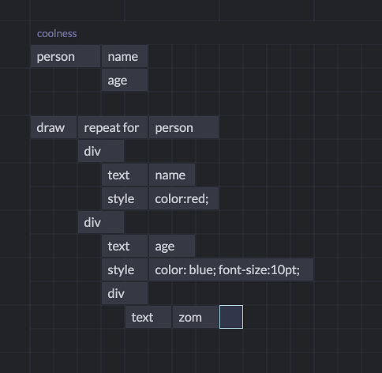

```
---
layout: post
title: "Eve Dev Diary (April 2016)"
author: "Corey Montella"
tags: []
---
```

### UI

In March we revisited GridEve, adapting it to fit more in line with the ethos of Eve; GridEve had a runtime based on data-flow, but we've settled on a relational model for Eve, so there was a disconnect there. What we liked most about GridEve was the immediate usefulness of the grid model, so we decided to marry that with a relational engine in a new project: WikiGrid. In the last update, we looked at some interaction-level details of WikiGrid. Now, I'll show some of our ideas about how the relaional model can fit in a grid world.

#### Querying with Grids 

One obvious possibility is just to have relational functions and to allow the user to write them in cells. But that doesn't really take advantage of the relational nature of the Eve platform -- you could do this in any language. Eventually, we stumbled upon a really simple yet absolutely cool idea: give semantic meaning to cell adjacency. Consider this:


In this example, the cell `person` means "select all the entities tagged `person`". The adjacent cell `age` means "select the attribute `age` for the adjacent collection" i.e. `person.age`, which returns the set of all ages of people in the system. 

Building under that, we use a reserved word `without`, an alias for the anti-join operator. The adjacent blocks `width` and `height` mean `people.width` and `people.height`. So the overall quey will select all entities with a people tag and an attribute age, that do not have a width or height attribute.

In our textual syntax, this would be

```
(query [age]
  (fact name :tag "person" :age)
  (not
    (fact name :tag "person" :width :height))
```

This was very exciting for us, because you could basically write out a complicated query with no syntax. This was by far our fastest way to write a query yet. Here's what writing a query looks like.


Here, we mark off a 5x4 area as a macro cell. Then we name the macro cell "test" and give it a "Formula Grid" type. If you look closely at the autocomplete that pops up, you'll see the cell can take on many types: table, code, image, text, chart, drawing, etc. This gets at the idea that cells can contain anything.   

So let's put it all together and see how it works when it's hooked up to an evaluator. The runtime in this example was taken from [CardWiki]().


We start out in a grid and name it "Chris" by adding a attribute cell. Each grid is an entity in our system, so any attributes added to the grid are attached to that entity. Grids start out nameless, so giving it a name provides a handle to the grid. We then add two more attributes: an `age` and `tag`. Along with `name`, `tag` conventional attribute that groups similar entities. By adding the tag "person", we are now easily able to talk about collections of people just by joining on that tag.

Next, we create a formula grid, and we query for `person.age`. The result of the query shows up in the bottom half of the formula grid as we type. Chris is the only result, since he's the only entity in the system, so let's add some more. 

Chris has a friend named Rob, so we add him as a new entity under `chris.friend`. We then open a new blank grid for that entity, with the name attribute already populated. Now we just add `rob.age` and `rob.tag` and he shows up in the formula grid. We can do the same thing for Chris' other friend Bob, and we see he is added as well.

This is a relatively simple example, but we can write arbitrarily complex queries this way:



This query draws the name and age of a person in a HMTL. The name is in one div, styled red, while the age is in another div, styled blue.

### Platform Work ([github](https://github.com/witheve/Eve/tree/22fd8ad4be766f0308ad86ed33b1b0d0479fdd7f))


#### Language

We added more language features to the runtime, including `choose`, `not`, and various aggregates.

##### Choose

The `choose` statement works kind of like an `if` statement; it has multiple arms, one of which is chosed based on a condition. For us, each branch is its own sub-query. The condition is whether or not there are any results in the sub-query. The first branch of the subquery with a result is the chosen arm. Order of statements usually doesn't matter in Eve, but this is one case where it does. Take a look at this example:

```
(choose [grade score]
  (query 
    (>= score 90)
    (= grade "A"))
  (query 
    (>= score 80)
    (= grade "B"))
  (query 
    (>= score 70)
    (= grade "C"))
  (query 
    (>= score 60)
    (= grade "D"))
  (query 
    (> score 0)
    (= grade "F"))))
```

Here, we are assigning a letter grade given a numerical score. The `choose` statement itself has its own projection, so you can decide which variable internal to the `choose` are accessible in the parent query.

##### Not

The `not` statement is an anti-join operator. Its body is a query, and any results within are excluded from the parent query. For instance:

```
(query [names]
  (fact names :tag "people")
  (not
    (fact names :tag "employee")))
```

will return all of the entities tagged "people" that are not tagged "employee".

##### Aggregates

We managed to get some aggregates working for this version as well. Aggregates work just like regular functions, except they change the cardinality of the output. So `sum` takes in a set of cardinality N and returns a set of cardinality 1. You have to keep this in mind, or your results might not be what you expect. Here is an example of `sum` in practice:

```
(query [sum-result]
  (fact e :score)
  (= sum-result (sum score)))
```

#### REPL ([github](https://github.com/witheve/Eve/tree/a7ce1eb6eb8526057d5b29349c7116461e639559))

The REPL received several additional features. First, 


Build instructions:

Dependencies: Node.js, Clojure, [Leinengen](http://leiningen.org/)

First, download and install Node, if you don't already have it on your system. Then CD into the folder where you cloned Eve. Download node dependencies and compile the REPL:

```
> npm install
> node run.js --bundles repl
```

When the REPL is finished building, you can kill that process and cd into the server directory. Then, all you need to do is:

```
> lein run
```

This will compile the server and host the REPL at `http://localhost:8081/repl`.


#### UI Drawing

We also added the capability to specify UI with our syntax, obviating the need for HTML or CSS. 

```
(define-ui ci-run-result
  (fact test-run :tag "testrun" :number pr-number :branch :user :title :text description :additions :deletions)
  (fact test-result :tag "testresult" :run test-run :test :result)
  (fact-btu test-result "result" :tick)
  (= test-order (+ 100 (sort tick)))
  (= delta-text (str "(+" additions " / -" deletions ")"))
  (= pr (str "#" pr-number))
  (= url (str "https://github.com/witheve/Eve/pull/" pr-number))
  (= branch-url (str "https://github.com/witheve/eve/tree/" branch))
  (= user-url (str "https://github.com/" user))
  (= test-class (str "test " result))

  (ui [title pr pr-number url user user-url delta-text branch branch-url description]
      (div :id run-tile :parent "root" :ix pr-number :class "test-run")
      (h3 :id header :parent run-tile :ix 1)
        (div :parent header :ix 0 :class "spacer" :text title)
        (a :parent header :ix 1 :text pr :href url)
      (div :id user-tile :parent run-tile :ix 2 :class "run-info")
        (div :parent user-tile :ix 0 :text delta-text)
        (div :parent user-tile :ix 1 :text "in")
        (a :parent user-tile :ix 2 :text branch :href branch-url)
        (div :parent user-tile :ix 3 :text "by")
        (a :parent user-tile :ix 4 :class "user" :text user :href user-url)
      (blockquote :parent run-tile :ix 3 :class "description" :text description))

  (ui [run-tile test test-class test-order]
      (div :id test-tile :parent run-tile :ix test-order :class test-class)
      (div :parent test-tile :ix 0 :text test)))
```

which renders the following:


