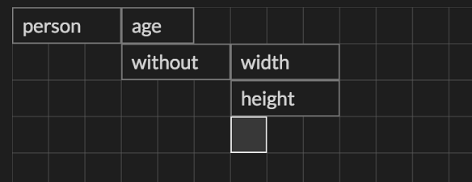
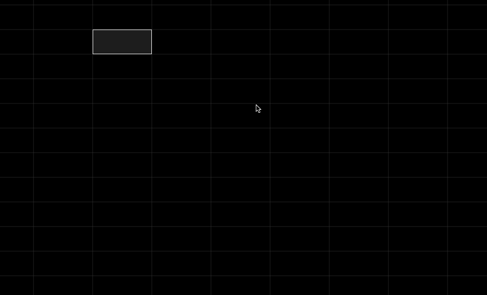
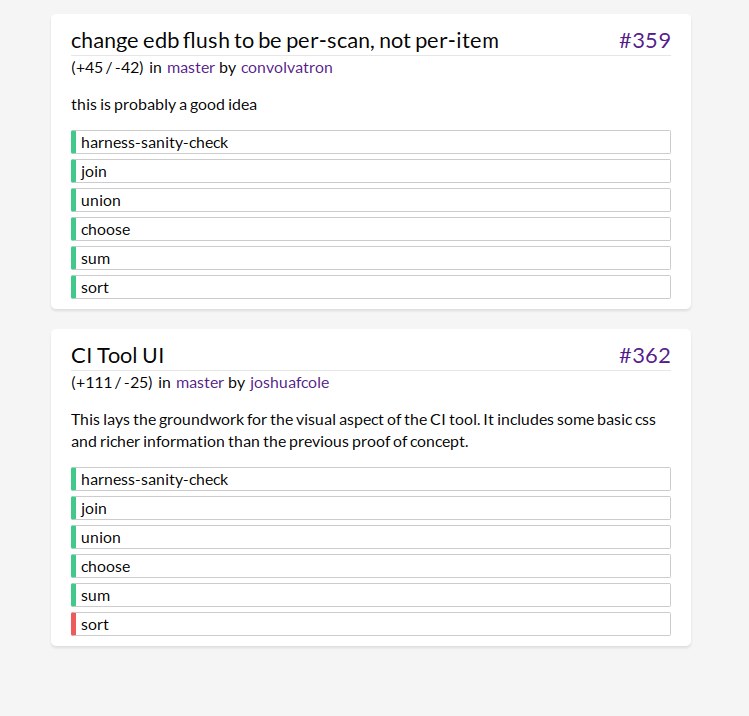

```
---
layout: post
title: "Eve Dev Diary (April 2016)"
author: "Corey Montella"
tags: []
---
```
### UI

#### Querying with Grids 

So now let's look at the really interesting bit. Take a look at this:



In this example, proximity to other cells has meaning. So the cell `person` means select all the entities tagged `person`. The adjacent cell `age` means select the attribute `age` for that colletion i.e. `person.age`. Building under that, we select `person.name` and `person.friend`. Taking it further, we can select attributes on `person.friend` e.g. ther names and ages. (note: we call them Name2 and Age2 so that they are not bound to the previously used name and age)

This was very exciting for us, because you could basically write out a complicated query with no syntax, since cell proximity holds semantic meaning. This was by far the fastest way to write a query yet. Here's how writing one of these queries works:




### Platform Work

#### Language

#### Repl

#### CI

```
(define-ui ci-run-result
  (fact test-run :tag "testrun" :number pr-number :branch :user :title :text description :additions :deletions)
  (fact test-result :tag "testresult" :run test-run :test :result)
  (fact-btu test-result "result" :tick)
  (= test-order (+ 100 (sort tick)))
  (= delta-text (str "(+" additions " / -" deletions ")"))
  (= pr (str "#" pr-number))
  (= url (str "https://github.com/witheve/Eve/pull/" pr-number))
  (= branch-url (str "https://github.com/witheve/eve/tree/" branch))
  (= user-url (str "https://github.com/" user))
  (= test-class (str "test " result))

  (ui [title pr pr-number url user user-url delta-text branch branch-url description]
      (div :id run-tile :parent "root" :ix pr-number :class "test-run")
      (h3 :id header :parent run-tile :ix 1)
        (div :parent header :ix 0 :class "spacer" :text title)
        (a :parent header :ix 1 :text pr :href url)
      (div :id user-tile :parent run-tile :ix 2 :class "run-info")
        (div :parent user-tile :ix 0 :text delta-text)
        (div :parent user-tile :ix 1 :text "in")
        (a :parent user-tile :ix 2 :text branch :href branch-url)
        (div :parent user-tile :ix 3 :text "by")
        (a :parent user-tile :ix 4 :class "user" :text user :href user-url)
      (blockquote :parent run-tile :ix 3 :class "description" :text description))

  (ui [run-tile test test-class test-order]
      (div :id test-tile :parent run-tile :ix test-order :class test-class)
      (div :parent test-tile :ix 0 :text test)))
```

which renders the following:



