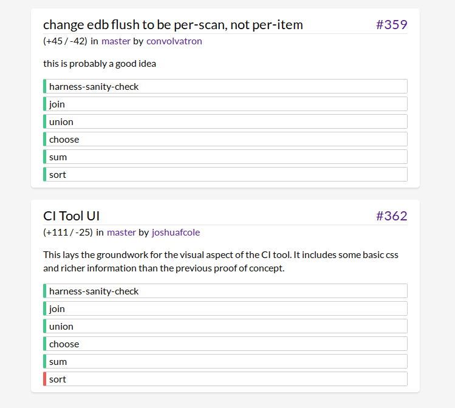

```
---
layout: post
title: "Eve Dev Diary (April 2016)"
author: "Corey Montella"
tags: []
---
```

### UI

In March we revisited GridEve, adapting it to fit more in line with the ethos of Eve; GridEve was operated in a very data-flow manner, but we've settled on a relational backend  

#### Querying with Grids 

So now let's look at the really interesting bit. Take a look at this:


In this example, proximity to other cells has meaning. So the cell `person` means "select all the entities tagged `person`". The adjacent cell `age` means "select the attribute `age` for the adjacent collection" i.e. `person.age`, which returns the set of all ages of people in the system. 

Building under that, we select `person.name` and `person.friend`. Taking it further, we can select attributes on `person.friend` e.g. ther names and ages. (note: we call them Name2 and Age2 so that they are not bound to the previously used name and age)

This was very exciting for us, because you could basically write out a complicated query with no syntax, since cell proximity holds semantic meaning. This was by far the fastest way to write a query yet. Here's how writing one of these queries works:


Here, we mark off a 5x4 area as a macro cell. Then we name the macro cell "test" and give it a "Formula Grid" type. If you look closely at the autocomplete that pops up, you'll see the cell can take on many types: table, code, image, text, chart, drawing, etc. This gets at the idea that cells can contain anything.   

So let's put it all together


We start out in a grid and name it "Chris". Each grid is essentially an entity in our system, so any attributes added to the grid are for that entity. Grid start out nameless, so giving it a name provides a handle on the grid. We then add two attributes: an `age` and `tag`. Next, we create a formula grid, and we query for `person.age`. The result of the query shows up in the bottom half of the formula grid as we type. Chris is the only result, since he's the only entity in the system, so let's add some more. 

Chris has a friend named Rob, so we add him as a new entity under `chris.friend`. We then open a new blank grid for that entity, with the name attribute already populated. Now we just add `rob.age` and `rob.tag` and he shows up in the formula grid. We can do the same thing for Chris' other friend Bob, and we see he is added as well.

This is a relatively simple example, but we can write arbitrarily complex queries this way:


This query draws the name and age of a person in a HMTL. The name is in one div, styled red, while the age is in another div, styled blue.

### Platform Work ([github](https://github.com/witheve/Eve/tree/22fd8ad4be766f0308ad86ed33b1b0d0479fdd7f))


#### Language

We added more language features to the runtime, including `choose`,  

#### REPL

The REPL received several additional features.

#### UI Drawing

We also added the capability to specify UI with our syntax, obviating the need for HTML or CSS. 

```
(define-ui ci-run-result
  (fact test-run :tag "testrun" :number pr-number :branch :user :title :text description :additions :deletions)
  (fact test-result :tag "testresult" :run test-run :test :result)
  (fact-btu test-result "result" :tick)
  (= test-order (+ 100 (sort tick)))
  (= delta-text (str "(+" additions " / -" deletions ")"))
  (= pr (str "#" pr-number))
  (= url (str "https://github.com/witheve/Eve/pull/" pr-number))
  (= branch-url (str "https://github.com/witheve/eve/tree/" branch))
  (= user-url (str "https://github.com/" user))
  (= test-class (str "test " result))

  (ui [title pr pr-number url user user-url delta-text branch branch-url description]
      (div :id run-tile :parent "root" :ix pr-number :class "test-run")
      (h3 :id header :parent run-tile :ix 1)
        (div :parent header :ix 0 :class "spacer" :text title)
        (a :parent header :ix 1 :text pr :href url)
      (div :id user-tile :parent run-tile :ix 2 :class "run-info")
        (div :parent user-tile :ix 0 :text delta-text)
        (div :parent user-tile :ix 1 :text "in")
        (a :parent user-tile :ix 2 :text branch :href branch-url)
        (div :parent user-tile :ix 3 :text "by")
        (a :parent user-tile :ix 4 :class "user" :text user :href user-url)
      (blockquote :parent run-tile :ix 3 :class "description" :text description))

  (ui [run-tile test test-class test-order]
      (div :id test-tile :parent run-tile :ix test-order :class test-class)
      (div :parent test-tile :ix 0 :text test)))
```

which renders the following:



