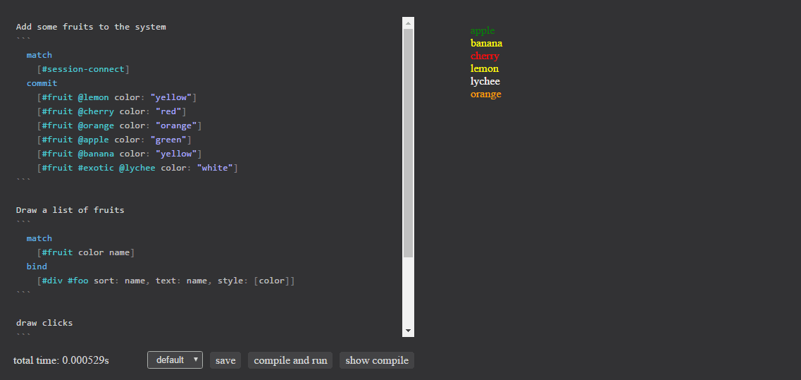
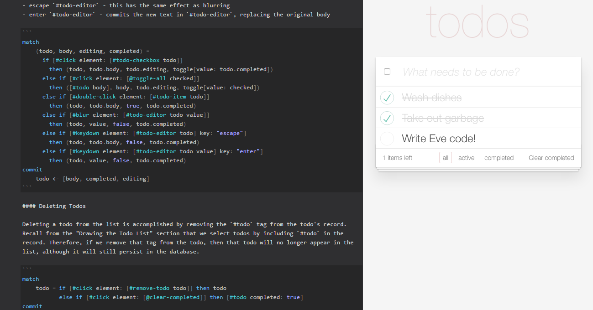
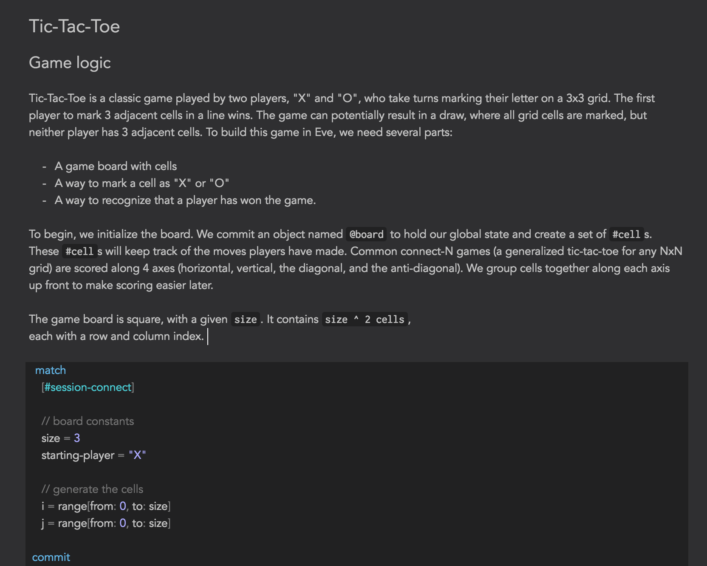

```
---
layout: post
title: "Eve Dev Diary (July 2016)"
author: "Corey Montella"
tags: []
---
```

### Eve Platform

### Syntax

### Error Handling

As with our syntax, we are aiming for error messages and handling to be disntincly designed for humans. 



### Event Handling

We also added events to Eve. 


### TodoMVC



### Eve + Markdown

