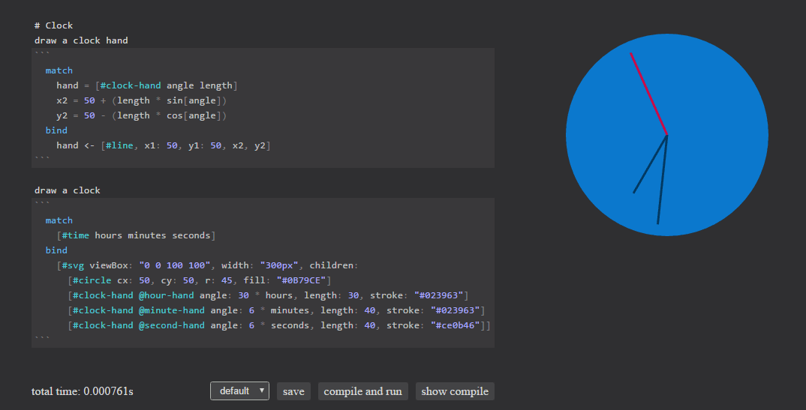
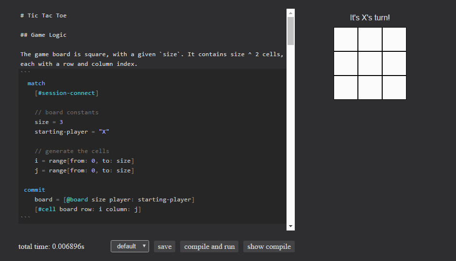

```
---
layout: post
title: "Eve Dev Diary (July 2016)"
author: "Corey Montella"
tags: []
---
```

### Eve Platform

### Syntax

We introduced a textual syntax this month that targets the first users of the Eve platform: developers. Right now, the  


We talked about the general need for an Eve syntax in a [previous dev diary](http://incidentalcomplexity.com/2016/06/30/apr/), 


1. **For Humans** - This syntax is designed for humans, not compilers.
2. **Readable** - Since code is read more than written, we want the syntax to be eminently readable.
3. **Familiar** - Users unfamiliar with Eve should be able to read an Eve program and figure out what's going on at a high level.
4. **Different** - This one is purposefully in contention with goal (3); we want the syntax to be familiar but not *too* familiar. If our syntax is too close to other languages (e.g. if we used c-style curly braces), we might give the expectation that our semantics are similar, when they are very different.

### Error Handling

If you've ever seen a [C++ template error](http://codegolf.stackexchange.com/questions/1956/generate-the-longest-error-message-in-c), you've felt the pain of indecipherable error messages. Or have you ever forgotten a terminating semicolon? In that case, the error message is typically a red-herring, indicating an unrelated error, where the fix is just to add the missing semicolon.


As with our syntax, we are aiming for error messages and handling to be disntincly designed for humans. Take this example:


Here, the user types `#cool`, which is syntactically incorrect. The compiler returns an error message pointing out the line and character of the error, and the reason for the error and a suggestion on how to correct it in plain English. We even go a step further, providing a "Fix it for me" button that applies the fix automatically and re-evaluates the program.

Obviously, this is a simple error, and not every mistake can be fixed automatically, but 

### Event Handling

We also added events to Eve. 



### TodoMVC





### Syntax Highlighiting + Markdown

### Example Applications

As part of testing our language, we've been busy writing more substantial applications than we have to date. 

### Community

This month we introduced our [Request for Comments (RFC)](https://github.com/witheve/rfcs) process. RFCs have worked well for other languages as a way to engage with the community and move the language forward in a way that is collaborative. Already, our RFC process is off to a good start, with our first two RFCs underway:

- [Syntax](https://github.com/witheve/rfcs/blob/master/proposed/syntax.md)  - [Discussion](https://github.com/witheve/rfcs/issues/4) - This RFC is our formal proposal for the developer syntax.
- [Strings](https://github.com/witheve/rfcs/blob/master/proposed/strings.md) - [Discussion](https://github.com/witheve/rfcs/issues/5)
 