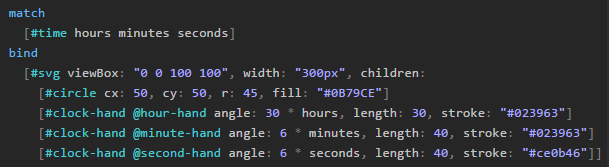
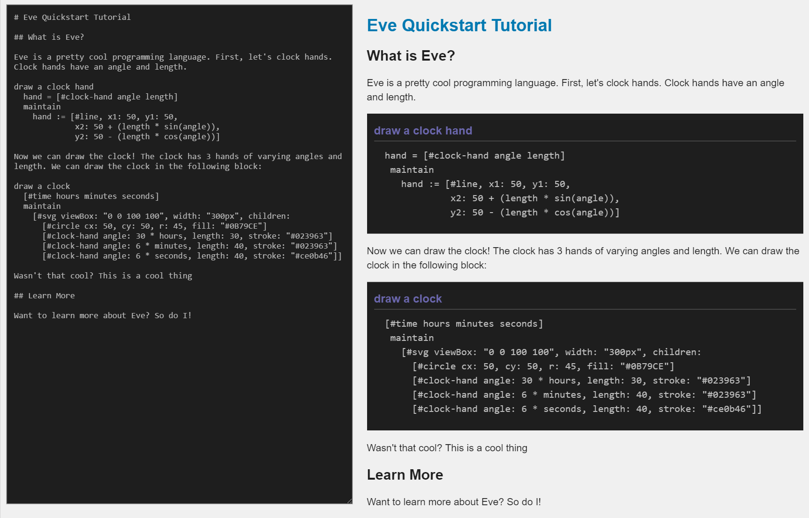
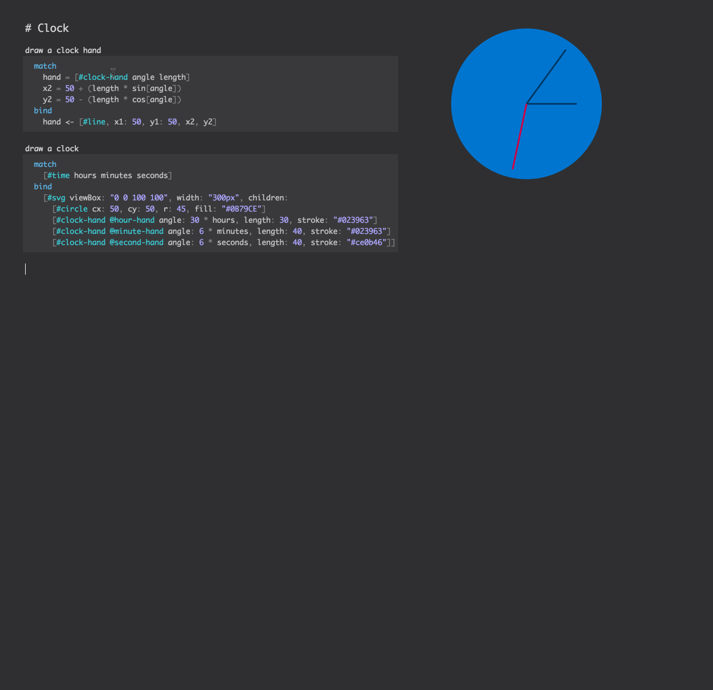

```
---
layout: post
title: "Dev Diary (August 2016)"
author: "Corey Montella"
tags: []
---
```

_(Eve is a new programming language, and this is our development blog. If you're new to Eve, [start here][0])_

[0]: https://github.com/witheve/Eve

The majority of August was spent adding language features, fixing bugs, writing documentation, and listening/responding to community feedback.

### Platform

The Eve platform saw rapid improvements over the last month as we quickly responded to user feedback. As is the case when all projects are set loose in the wild, we encountered stability, performance, and usability concerns almost immediately.  

#### Word Choice Adjustments

One of the most difficult aspects of developing a language is deciding on the words and verbiage used to describe Eve concepts. Choosing the wrong words can alienate users and make things more confusing than they need to be. Therefore, we've spent countless hours in the office looking at thesauruses and dictionaries, trying to find the right word for a given concept. In presenting the language to new users, we've found some of the choices that made sense to us didn't make sense to others. For instance, we used to talk about "freezing", but community feedback suggested that word didn't provide an intuition for how that command actually worked.

So for anyone following our development, but not following the [Syntax RFC discussion][2.2.1], we've made the following adjustments to how we talk about Eve:

```
freeze   -> commit
maintain -> bind
object   -> record
bag      -> context
```

#### New Function Syntax

Whereas most languages use functions to accomplish code-reuse, Eve takes a different route; our records obviate the need for most functions. Therefore, we don't fully support user defined functions at the moment. Nonetheless, functions are useful for primitive operations, like math or string manipulation. Therefore, we adjusted our function syntax to look a little more like the record syntax.  

Let's look at the sine function:

```
y = sin[degrees: 90]
```

The first thing to notice are the square brackets. These are reminiscent of the record syntax, which also uses square brackets. That's because a function call is really just sugar for: 

```
[@sin #function degrees: 90 value]
``` 

Which is a record like any other. The new function syntax uses the `value` attribute as an implicit return, so functions can be inlined into expressions. The second thing to notice is that arguments are explicitly defined at the call site. This has several nice properties. First, it makes code more readable and self-documenting; any reader unfamiliar with the function arguments can read them where the function is called, without having to look up documentation. Second, it allows a nice mechanism to provide alternative arguments. For instance, we could use the sine function with a radian input:

```
y = sin[radians: angle]
```

The reader of this program doesn't need to guess if the input is radians or degrees. Finally, this syntax allows for optional arguments. For instance, in the case of `count`, the `per` argument is optional. So we can use count in the following ways:

```
y = count[given: students]
y = count[given: students, per: grade]
```

#### Syntax Highlighting

We added syntax highlighting to the built-in editor.



#### Eve + Markdown

One key feature of the Eve programming model is that the order of statements doesn't matter (in most cases). A nice implication of this property is that we can write Eve code in an order that makes sense for a human, as opposed to writing code in an order that is imposed by the compiler or runtime. This idea is the basis for [literate programming][1.3.1], a practice for writing programs introduced by Donald Knuth in 1981. The idea behind literate programming is to treat a program as a document of prose written for a human audience, with code interspersed throughout. In writing this way, a programmer can use prose and formal methods to reinforce one another.




Whereas other literate programming implementations require a "tangle" step to turn a literate program into a compilable program, Eve's ability to write code in any order means a `*.eve` file can be rendered as markdown or executed by Eve without any additional compilation step. We accomplish this by being CommonMark compatible; Eve programs are written just as you would write any markdown document, but code blocks containing Eve code are actually executable.

We've written a few literate programs this way. If you follow our blog, you've already seen some of them:

- [Tic-Tac-Toe][1.3.2]
- [TodoMVC][1.3.3]
- [FlappyBird][1.3.4]

Each of these blog posts are executable Eve programs "as-is"; just send them through the Eve compiler and they'll run.

[1.3.1]: https://en.wikipedia.org/wiki/Literate_programming
[1.3.2]: http://incidentalcomplexity.com/2016/08/11/tic-tac-toe/
[1.3.3]: http://incidentalcomplexity.com/2016/08/19/todoMVC/
[1.3.4]: http://incidentalcomplexity.com/2016/08/23/flappy-eve/

#### "Pixels"

We've been thinking a lot about what kind of graphical tools would be useful for working with the textual version of Eve. One thing missing from Eve is the ability to explore the contents of the Eve DB. Without this ability, Eve is as opaque as any other programming language. After all, the ability to inspect your program as it executes is one of the core features of our language. 

An idea we keep coming back to is the concept of "pixels" (an internal name for now). Pixels are small graphical elements that represent records in the system. By default, they are just small squares, but a programmer can imbue them with properties that visualize the records they represent. For example, a graph can be constructed out of pixels by applying height and position properties to pixels, like in this example:



In this example, we use `#pixel` to inspect some records. Three pixels are displayed, one for each `#clock-hand`. In this case, since we're inspecting records, the pixels display the attributes and values for each of the records. Then, we change to a different mode and look at the history of a specific attribute on `#clock-hand`s, namely `x2`. This results in three graphs illustrating how `x2` changes for each hand over time.

Obviously, this is just a concept at the moment, but the core idea we like about pixels is how flexible they are. We can package some default functionality, like the record inspector and history illustrated here. But even more importantly this functionality should be trivially extended by the programmer.

### Community

I'm especially excited by the engagement we've seen from the community so far. It's hard to know exactly how many people are following our development and using Eve, but so far we've received comments and feedback from Sydney, Copenhagen, Moscow, Finland, Hong Kong, and many other places. I think it's safe to say Eve is being used around the world!

#### Issues + Pull Requests

Thank you to everyone who submitted a PR or an issue report. Specifically, thank you to [@btheado][2.3.1],  [@bertrandrustle][2.3.2], [@RubenSandwich][2.3.3], [@frankier][2.3.4], [@dram][2.3.5], and [@martinchooooooo][2.3.6]. Let me know if I missed anyone!  


[2.3.1]: https://github.com/btheado
[2.3.2]: https://github.com/bertrandrustle
[2.3.3]: https://github.com/RubenSandwich
[2.3.4]: https://github.com/frankier
[2.3.5]: https://github.com/dram
[2.3.6]: https://github.com/martinchooooooo

#### RFCs

The syntax RFC received a lot of [activity][2.2.1] this month, surpassing 100 comments from over a dozen users. Your comments have been very well thought out, provocative, and very constructive, so thank you to everyone who has participated so far. Due to the feedback we received, we've already made several adjustments to the syntax, including changes to keywords and the general vocabulary of Eve.

[2.2.1]: https://github.com/witheve/rfcs/issues/4

#### Documentation

##### Syntax Quick Reference

We put together a short [syntax reference][2.5.1] with all the necessary details to help you write Eve programs.

##### Eve Handbook

The [Eve Handbook][2.5.2] has received some work this month, particularly in the area of documenting the standard library. If you'd like to contribute to the development of Eve, this is the easiest way to get started. You don't even need to contribute any content; just pointing out the shortcomings of this document will help in its development. Major areas of improvement include:

- Completeness - are there any missing gaps?
- Accuracy - is the handbook true to Eve?
- Exposition - is the document written in an order that helps people learn the language? 
- Examples - many examples are needed, especially for the standard library

We'll be improving the handbook and other documentation daily, so keep checking back.

[2.5.1]: https://github.com/witheve/assets/blob/master/docs/SyntaxReference.pdf
[2.5.2]: https://github.com/witheve/docs/blob/master/drafts/handbook/contents.md