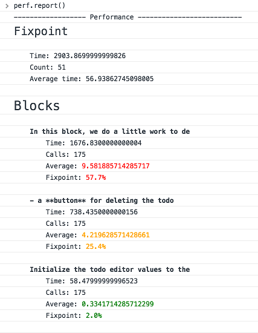
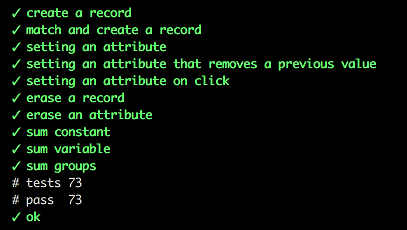
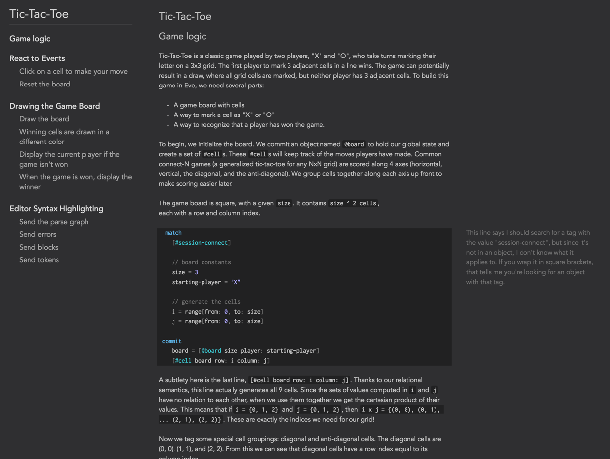
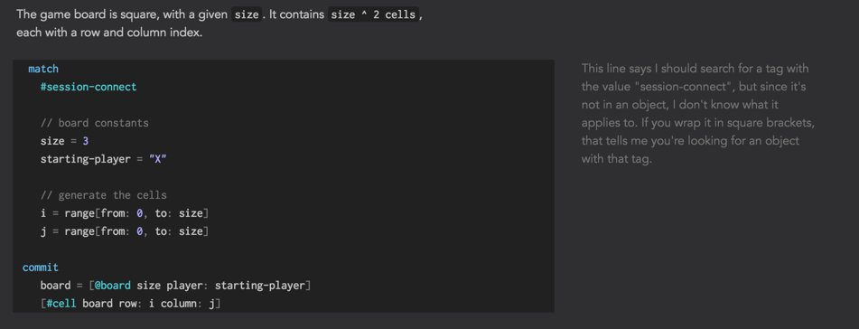
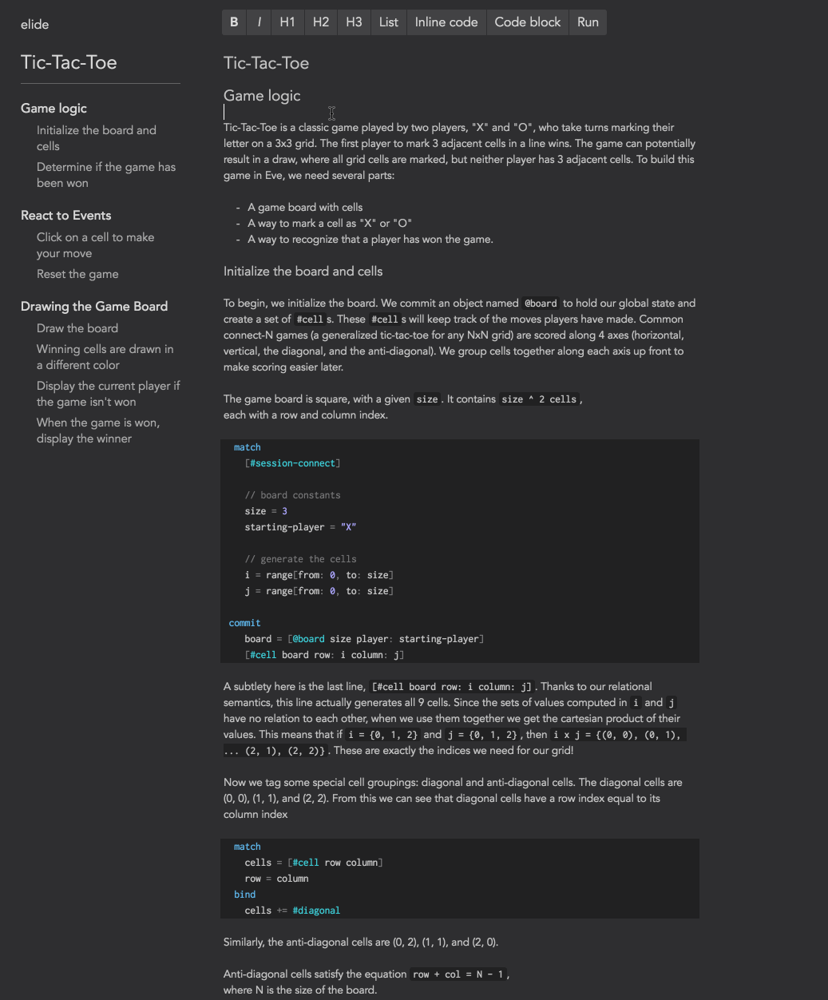

```
---
layout: post
title: "Dev Diary (September 2016)"
author: "Corey Montella"
tags: []
---
```

### Platform

#### Eve on the Web

Eve in typescript




#### Editor



editing experience



automatic table of contents generation




#### Word Choice Adjustments

In August, we tentatively settled on the term "context" in place of "bag" to describe a partition of facts. After testing "context" for a couple weeks, we came  to the conclusion that it just wasn't the right word. It just didn't fit the concept. Instead, we've decided on "database", which is a much more obvious and standard choice. We've found that "database" engenders an intuition close to the actual concept. 

We also decided to rename `match` to `search`. Match was supposed to evoke the idea of pattern matching against data. This wasn't clear to some people, and we've found that search is more intuitive. Furthermore, 

```
bag -> context -> database
match -> search
```

#### Name Sugar @

We've been using `@` as a shortcut for the name attribute on records. For example, instead of writing `[name: "Corey"]` you could write `[@Corey]`.

After writing more applications, we've found that the name attribute isn't actually that common. Furthermore, the tag shortcut `#` can be used instead with the same effect. Finally, the semantics of `@` in Eve are different from `@` in other contexts like Twitter and Github; whereas `@` resolves to a unique username, `@` in Eve could match against multiple records. After all, name is just an attribute like any other.

So we're removing that sugar, and instead using `@` to reference databases. If you recall, databases 


### Community

We've been a little quiet on the blog, but community efforts are still abound!

#### Handbook

We've put a lot of work into witheve/docs. The handbook is now about 80% complete, and can no be browsed in a website version. In October, we'll be making the site more comprehensive and focus on styling and completeness.

#### Guides

The long awaited quickstart guide is coming along nicely. It's gone through a few iterations of user feedback, and we'd like to hear from a wider audience. This guide should take you from 

#### Community Eve Repositories

Since August, a number of people have sent us projects they've built in Eve.

https://github.com/zubairq/Eve/tree/master/tutorial
https://github.com/frankier/eve-experiments/blob/master/minesweeper.eve
https://github.com/jimmyhmiller/eve-playground/blob/master/ultimate-tic-tac-toe.eve