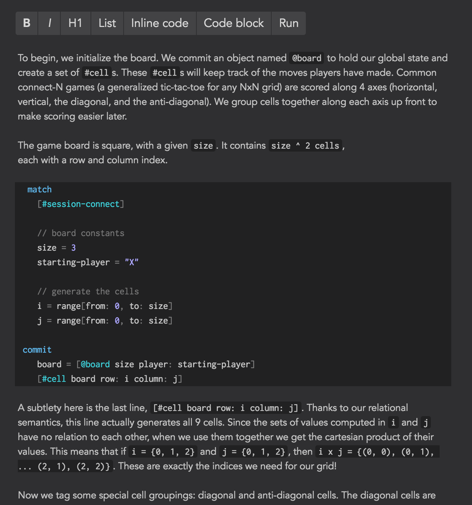
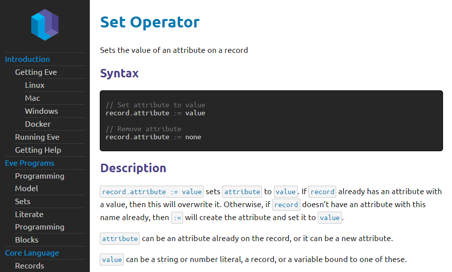

```
---
layout: post
title: "Dev Diary (September 2016)"
author: "Corey Montella"
tags: []
---
```

(Eve is a new programming language, and this is our development blog. If you’re new to Eve, [start here](https://github.com/witheve/Eve))

When we last left off in [August][0.1], we were iterating on the just-released community preview. In September, we improved the editor, worked on documentation, made some adjustments to the language, and also put Eve up on the Web.

[0.1]: http://incidentalcomplexity.com/2016/08/31/august/

### Platform

#### Editor

A lot of work has gone into imagining the editing experience for Eve. Here is [Tic-Tac-Toe][2.0] displayed in the editor:


On the left, we display the table of contents, in the center is the rendered program, and on the right is an area for comments. Let's look at each one in turn: 

[2.0]: https://github.com/witheve/Eve/blob/master/examples/tic-tac-toe.eve

##### Table of Contents

The table of contents (TOC) is one of the more interesting features of the editor. The TOC is generated using the `h1`, `h2`, and `h3` headers in the document. This allows you to bookmark key sections of the program. Clicking on a heading moves the section into focus, so this is a nice way to navigate through a larger program. 

But we can go one step beyond this. One criticism of [literate programs][] is that an ordering that makes narrative sense doesn't necessarily make sense while editing a program. For example, in the Tic-Tac-Toe, we talk about winning the game in two entirely different sections. That's okay, the editor allows us to display only the sections we care about: 


Now the editing experience is customized to the task at hand. This opens up some interesting possibilities, like being able to save and share these views, or generating customized views based on a query. For example, during a code review you might want to see all blocks modified by Steve in the last week. Something like that is further down the line, but it's nonetheless an interesting possibility.

[2.1]: https://witheve.github.io/docs/handbook/literate-programming/

##### Document Editing

We've improved the editing experience with in-browser WYSIWYG support. One of the slight drawbacks of being [CommonMark compatible][2.2] is having to type code fences for every block of code. Not only is this sometimes tedious, but backticks and tildes are not even on some international keyboards. Fear not: if you write code in our editor (and we hope you will, but you don't have to) you can create a codeblock with a nifty shortcut.   



[2.2]: http://incidentalcomplexity.com/2016/08/31/august/#eve-and-markdown

##### Comments

Finally, the editor has an area for comments. These aren't code comments (you can write those in the actual code, as shown here). Rather, you can think of this area as a place for collaborative comments from team members, similar to Google Docs. This area can also contain comments from Eve itself:


Here, you can see a compiler error displayed next to the block that generates it. It's not hooked up here, but we've shown previously how errors like this can be [fixed automatically][2.3] with the click of a button. 

[2.3]: http://incidentalcomplexity.com/2016/08/03/july/#error-handling

#### Eve on the Web

Another big development this month is a version of Eve written in TypeScript. This has the notable advantage over the C/Lua version of being able to work on every platform, including Windows. Also, in this version we've started to add some debugging tools. Here's an example of a performance report, which displays performance statistics for each block:

 

We've also added some [testing facilities][3.1] for language-level sanity checks:


We'll have a lot more to talk about on this front in a couple of weeks, so stay tuned.

[3.1]: https://github.com/witheve/Eve/tree/ts-merge/test

#### Word Choice Adjustments

In August, we tentatively settled on the term "context" in place of "bag" to describe a collection of facts. After testing "context" for a couple weeks, we came to the conclusion that it just wasn't the right word; it didn't adequately describe the underlying concept, and thus it was misleading to some people. Instead, we've decided on "database", which is a much more obvious and standard choice. We've found less confusion in using this word, so it seems like a win so far. Let us know what you think over at the [syntax RFC][4.0].

We also decided to rename `match` to `search`. Match was supposed to evoke the idea of pattern matching against data. This wasn't clear to some people, and we've found that search is more intuitive.

```
bag -> context -> database
match -> search
```

[4.0]: https://github.com/witheve/rfcs/issues/4

#### Changing the meaning of `@`

We've been using `@` as a shortcut for the name attribute on records. For example, instead of writing `[name: "Corey"]` you could write `[@Corey]`.

We've made this decision for several reasons. First, after writing more applications in Eve, we've found that the name attribute isn't actually commonly used, so a shortcut doesn't save that many characters. Furthermore, the tag shortcut ( `#` ) can be used instead with the same effect. Finally, the semantics of `@` in Eve are different from `@` in other contexts; whereas `@` resolves to a unique username on Twitter and Github, `@` in Eve could match against multiple records. After all, name is just an attribute like any other.

Therefore, we're removing that sugar, and instead we'll be using it exclusively `@` to reference databases. If you recall, databases are containers of facts. You can perform actions, like searching or binding, on one or more databases. With the removal of the name shortcut, we can now treat databases as first-class citizens of the Eve langauge:

```
match
  db = if [#foo] then @db1
       else @db2

bind db
  [#bar]
```

### Community

We've been a little quiet on the blog, but community efforts are still abound!

#### Handbook



We've put a lot of work into witheve/docs. The handbook now has a lot more content, and can be [browsed on the web][6.0]. In October, we'll be making improvements with a focus on styling and completeness.

[6.0]: https://witheve.github.io/docs

#### Quick Start Guide

The quick start guide is coming along nicely. It's gone through a few iterations of user feedback, and we'd like to hear from a wider audience. The guide starts by showing you "Hello World!" in Eve, and from there slowly introduces language concepts until you have the tools to write a simple web app. We hope you'll [give it a read][7.0] and let us know how it can be improved.

The [quick(er) start guide][7.1] follow the same narrative as the quick start, but contains only the key points. This guide should get you going in about 5 to 10 minutes, for those who just want to hack around with Eve.  

[7.0]: https://witheve.github.io/docs/guides/quickstart/
[7.1]: https://witheve.github.io/docs/guides/quickerstart/

That's all for September. But as I said earlier, we have some exciting stuff in the pipeline for October.